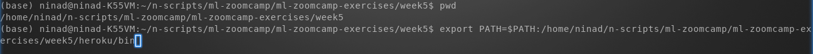
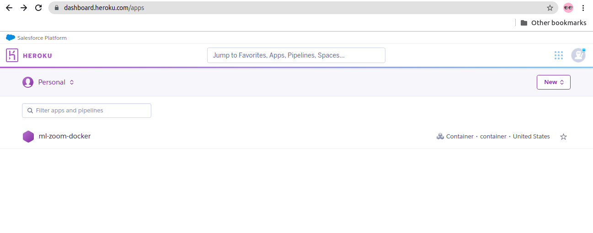

### Steps to deploy your python web app to Heroku cloud

<a id='toc'></a>
<a id='toc'></a>
## Table of Contents
* [1. Preparation](#preparation)
* [2. Deploy your Web app to Heroku as a docker container](#deploy-app)


----
<a id='preparation'></a>
[back to TOC](#toc)
### 1. Preparation
#### 1.1 Create account in Heroku

Go to https://www.heroku.com/ and Signup


You can also setup Google authenticator app on your mobile to get a token (OTP) and use it for Multi-factor authentication when logging in to Heroku.

Once logged in, you can deploy your web app to Heroku.


#### 1.2. Install Heroku command line interface (cli) on your machine

There are multiple ways to deploy a web app on Heroku (via the Heroku Dashboard, using CLI from your machine), of which I used the CLI option.

There are multiple options availabe to install Heroku cli - which can be found here - https://devcenter.heroku.com/articles/heroku-cli. I chose downloading the tarball, since it does not need any installation. 

**a. Download tarball**

To install from tarball, go to https://devcenter.heroku.com/articles/heroku-cli#tarballs and download the tarball for the Operating system of your machine. I downloaded for Ubuntu.

**b. Extract tarball**

Extract the tarball (Step fo Ubuntu shown below. For Windows simply use the WinZip or equivalent to extract/unzip from tarball).


**c. Add heroku/bin to your PATH**

To add the heroku/bin path on a Linux machine, execute the below command. For Windows refer to https://helpdeskgeek.com/windows-10/add-windows-path-environment-variable/



----
[back to TOC](#toc)
<a id='deploy-app'></a>
### 2. Deploy your Web app to Heroku as a docker container
When using Heroku, you can deploy your Web app as a docker container to Heroku.

To be able to deploy to Heroku as a docker container, you need to first have docker installed and running on your machine. 
1. Clone this repo (if you have not done this already. If done then skip this step)

```
git clone https://github.com/nindate/mlzoomcamp-midterm-project.git
```

2. Change to the directory that has the model file, python script (predict.py) for the web service and other required files for deployent to Heroku

```
cd mlzoomcamp-midterm-project/heroku-app-deploy
```

3. Login to heroku from your machine. Verify heroku command is found (In step 1.2.c. above the path has already been set) in the path. Then using heroku cli, login to heroku.  Press any key when asked to do so.

```
which heroku
heroku login
```


  
This will open a tab in your web browser asking you to login to Heroku. Login to Heroku.


Now you can close this tab and return to the command prompt on your terminal
  


4. Login to Heroku container registry

```
heroku container:login
```


5. Create app in Heroku: Create an app in Heroku. Below example shows creating a app with the name ml-zoom-docker.

```
heroku create ml-zoom-docker
```


6. Push docker image to Heroku container registry. When you run the below command, the Dockerfile will be used to build the docker image locally on your machine and then push the image to Heroku container registry. Using the -a flag you specify the application name (e.g. ml-zoom-docker app that you created above).

```
heroku container:push web -a ml-zoom-docker
```


7. Release container. Deploy container on Heroku. When you run the below command, a docker container will be launched in Heroku from the docker image that you pushed to Heroku container registry.

```
heroku container:release web -a ml-zoom-docker
```


8. Test the app. 

Before you can test the app (run the request.py script provided in this repo), ensure you have followed the steps in step 4 of [this tutorial](https://github.com/nindate/mlzoomcamp-midterm-project#4-virtual-environment-and-package-dependencies) to install and activate Python virtual environment with dependency packages installed.

Now you can test the app by running following command

```
python cloud-request.py
```

9. Screenshots of successful app deployment in Heroku and successful response (prediction) from the service

Following screenshot shows successful Web app deployed in Heroku cloud



Following screenshot shows successful response from the Web app deployed in Heroku cloud


